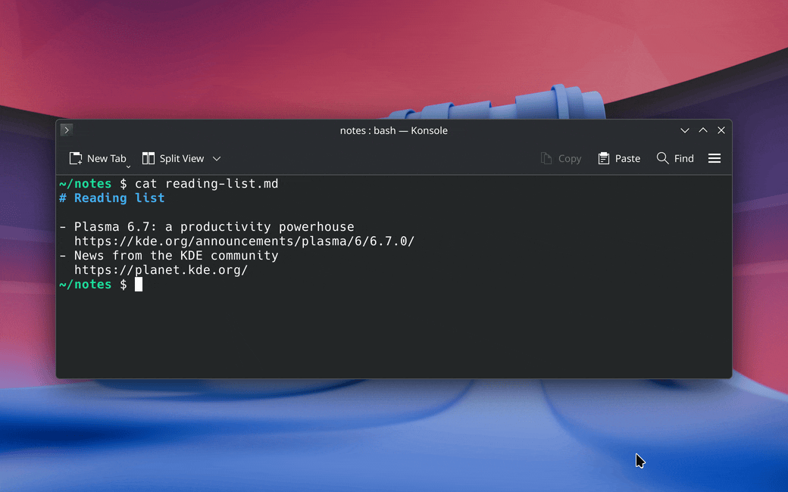
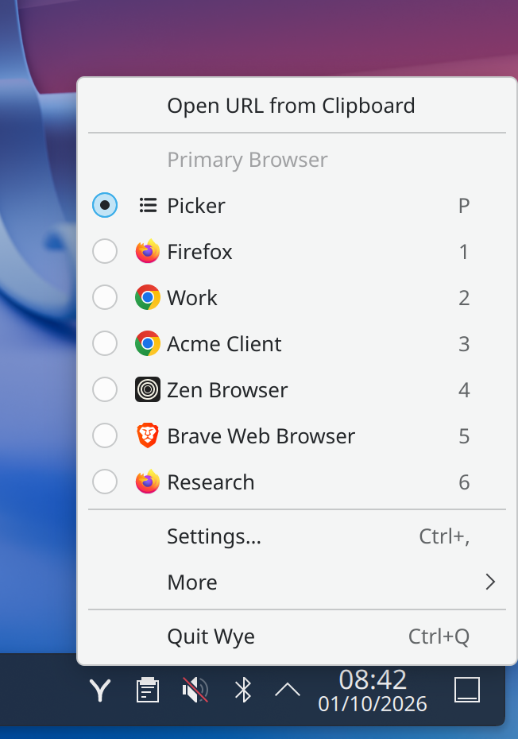
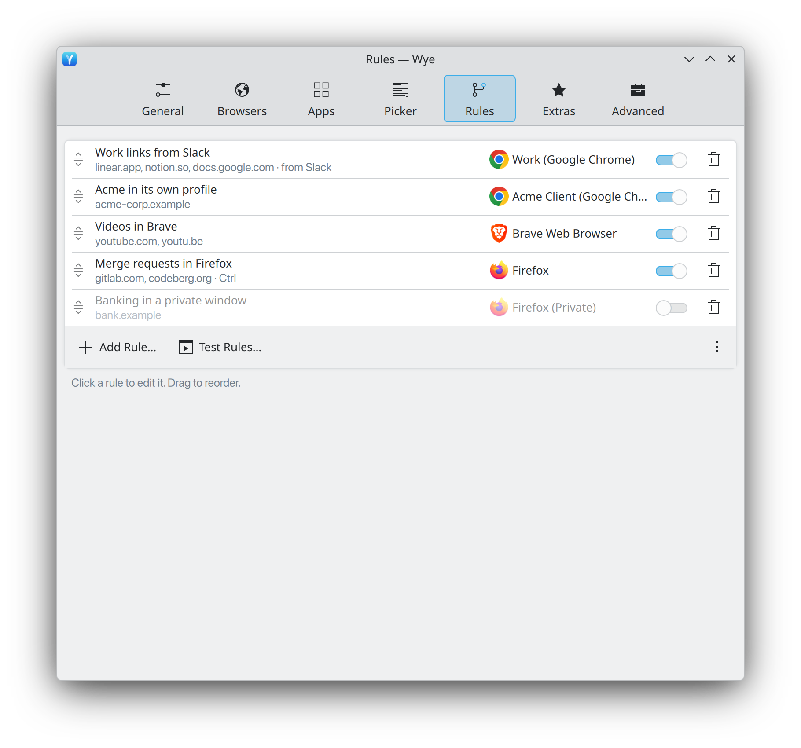
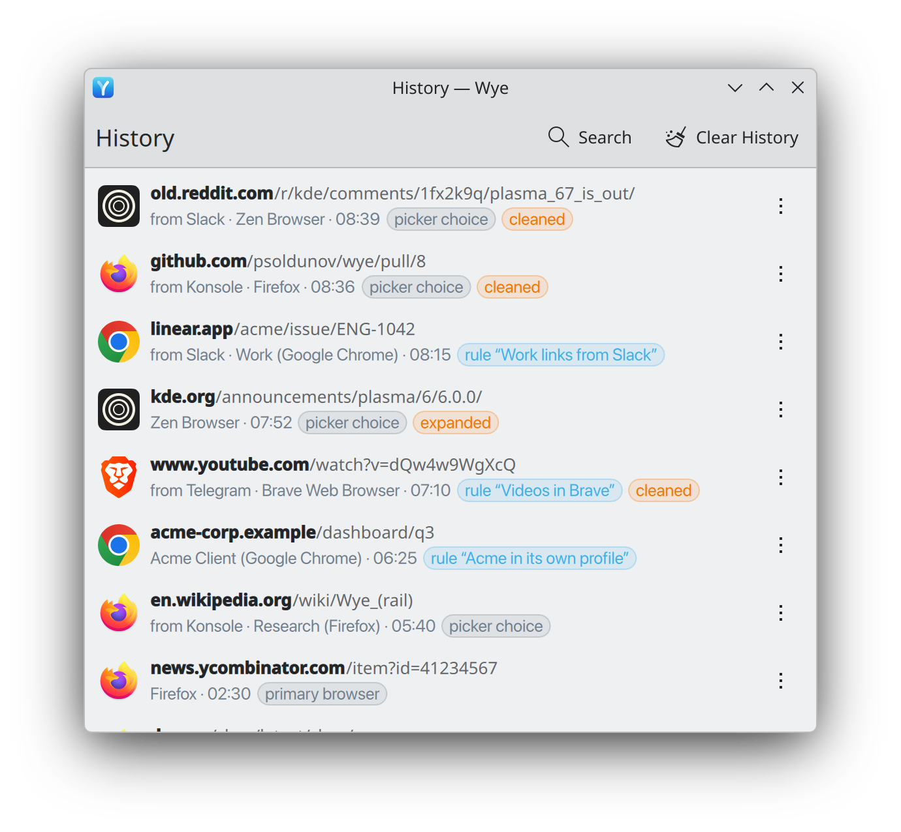

<p align="center">
  
</p>

<h1 align="center">Wye</h1>

<p align="center">Every link, in the browser you want.</p>

<p align="center">
  <picture>
    <source media="(prefers-color-scheme: dark)" srcset="docs/media/kde/screenshots/dark/picker.png">
    
  </picture>
</p>

<p align="center">
  
</p>

Wye is a native Linux browser picker written in Rust. It registers as the desktop's
default web browser and sends every link to the right browser, browser profile, private
window or desktop app, or asks you with a small picker when no rule decides. It looks like
it shipped with your desktop, in the spirit of
[Token Station](https://github.com/psoldunov/token-station).

- **Rules** pick a target by link, by the app that opened it, or by both, and can run a
  small JavaScript transform on the link first.
- **The picker** asks when no rule decides. Hold a key to open the alternative browser or
  a private window instead.
- **Link cleaning** removes tracking parameters and unwraps redirects such as safe-link
  wrappers, and expands shortened links.
- **The tray** shows the current default, the clipboard link and your recent links.
- **The browser extension** sends a link or the page you are on to Wye.

KDE Plasma 6 comes first: the global shortcuts portal and the source-app and
focused-window detection target it. The tray icon is a standard StatusNotifierItem, so it
shows in Plasma's system tray and in any other tray that supports the protocol. Alongside
the KDE frontend, GNOME has its own: a GNOME Shell 48+ extension draws the picker and the
tray menu, and GTK 4/libadwaita windows (Settings, rules, history and the rest) replace the
Qt ones. With the GNOME frontend chosen on a window manager such as Sway, Hyprland or niri,
the same GTK host (`wye-gtk`) also shows the picker and the tray menu, as a layer-shell
overlay where the compositor has one. Settings → Advanced → Interface → Frontend (`advanced.frontend`, or
`programs.wye.frontend` in the Nix modules) picks KDE, GNOME or Automatic, which uses GNOME
on GNOME and KDE everywhere else. [Take the GNOME tour](docs/tour-gnome.md). The core and
CLI work on any Linux desktop; Sway and Hyprland still lack some desktop-specific extras
(see [Not yet implemented](docs/architecture.md#not-yet-implemented)).

The specification starts at [docs/spec/README.md](docs/spec/README.md); the design is in
[docs/architecture.md](docs/architecture.md) and the D-Bus contract in
[docs/dbus-api.md](docs/dbus-api.md).

## Tour

<p align="center">
  <picture>
    <source media="(prefers-color-scheme: dark)" srcset="docs/media/kde/screenshots/dark/tray-menu.png">
    
  </picture>
  <picture>
    <source media="(prefers-color-scheme: dark)" srcset="docs/media/kde/screenshots/dark/settings-rules.png">
    
  </picture>
  <picture>
    <source media="(prefers-color-scheme: dark)" srcset="docs/media/kde/screenshots/dark/history.png">
    
  </picture>
</p>

The tray, the rules and the history, on KDE Plasma 6. [Take the tour](docs/tour.md) for
every surface: the picker and its menus, all the Settings pages, the rule editor and
tester, the transform script editor and the first run.

## Install

Wye runs on x86_64 and aarch64 (arm64). Each [GitHub
release](https://github.com/psoldunov/wye/releases/latest) carries a `.deb`, an `.rpm` and
an AppImage for both (see [Debian, Fedora and other
distributions](#debian-fedora-and-other-distributions)). On NixOS, or with Nix on any
distribution, Wye ships as a Nix flake with two channels:

| Channel | What it builds | Use it when |
|---------|----------------|-------------|
| `release` | The latest tagged release, built by that release's own flake. | You want a version that was tagged and built in CI. This is the default once a release exists. |
| `git` | The flake's own source, which is the latest master commit when the input tracks master. | You want the newest changes. |

`nix/release.json` records the latest release: after each tag, the release workflow opens a
pull request that writes the tag's commit and content hash there. While it records none,
only the `git` channel exists and it is the default. Each channel is a package:
`packages.<system>.wye-release` and `packages.<system>.wye-git` (`default` is `wye-git`),
for `x86_64-linux` and `aarch64-linux`.

Try it without installing:

```sh
nix run github:psoldunov/wye -- browsers
```

### home-manager

```nix
{
  inputs = {
    nixpkgs.url = "github:NixOS/nixpkgs/nixpkgs-unstable";
    home-manager.url = "github:nix-community/home-manager";
    home-manager.inputs.nixpkgs.follows = "nixpkgs";
    wye.url = "github:psoldunov/wye";
    wye.inputs.nixpkgs.follows = "nixpkgs";
    wye.inputs.home-manager.follows = "home-manager";
  };

  outputs = { nixpkgs, home-manager, wye, ... }: {
    homeConfigurations.me = home-manager.lib.homeManagerConfiguration {
      pkgs = nixpkgs.legacyPackages.x86_64-linux; # or aarch64-linux
      modules = [
        wye.homeManagerModules.default
        {
          programs.wye = {
            enable = true;
            channel = "release"; # or "git"
            defaultBrowser = true;
            settings = {
              browsers.primary.picker = true;
            };
          };
        }
      ];
    };
  };
}
```

The module installs the package, links the D-Bus activation files,
and runs `wye service` as the systemd user unit `wye.service`. The UI host `wye-ui` (picker,
windows, tray-menu popup) runs as `wye-ui.service`, started by D-Bus activation when the
service first needs it.

| Option | Meaning |
|--------|---------|
| `programs.wye.enable` | Install Wye. |
| `programs.wye.channel` | `"release"` or `"git"`. Default: `release` when `nix/release.json` names a release, else `git`. Choosing `release` before a release exists fails with a message saying so. |
| `programs.wye.package` | The package to install. Defaults to the channel's package; set it to override. |
| `programs.wye.settings` | The contents of `$XDG_CONFIG_HOME/wye/config.toml`. When set, the file is a read-only link into the Nix store and Wye's Settings window cannot save. Leave it empty to keep the file writable. |
| `programs.wye.defaultBrowser` | Make Wye the handler of `http` and `https` in `mimeapps.list` (through `xdg.mimeApps`), and of HTML files when `settings.general.open-local-html` is on. On Plasma it also sets `BrowserApplication` in `kdeglobals`. |
| `programs.wye.launchAtLogin` | Start the service with the graphical session (default on). Off, it still starts on the first link. The unit owns login start (`WYE_LOGIN_MANAGED=on` or `off` on it): Wye writes no XDG autostart entry and removes a stale one it wrote, and its "Launch at login" setting shows the option's value as managed by Nix. The config file stays writable. |

The `release` channel builds with the packaging of the tagged release, so it brings its own
nixpkgs revision into the closure; the `nixpkgs.follows` line above applies to the `git`
channel. The module itself always comes from the flake revision you lock, so it installs a
release's package through the file layout every release keeps (listed in
`nix/channel.nix`). To move to a newer release run `nix flake update wye`.

The service's unit sets its own `PATH`, which desktop entries with a bare `Exec=firefox`
are resolved against: the Nix profile directories first, then `/usr/local/bin`,
`/usr/bin` and `/bin`.

### NixOS

```nix
{
  inputs.wye.url = "github:psoldunov/wye";

  outputs = { nixpkgs, wye, ... }: {
    nixosConfigurations.host = nixpkgs.lib.nixosSystem {
      modules = [
        wye.nixosModules.default
        {
          programs.wye = {
            enable = true;
            channel = "git"; # or "release"
          };
        }
      ];
    };
  };
}
```

`programs.wye.{enable, channel, package}` install the package system-wide, register its
D-Bus files (`services.dbus.packages`) and its systemd user units `wye.service` and
`wye-ui.service` (`systemd.packages`). `programs.wye.defaultBrowser` sets the system-wide
default handler, and `programs.wye.launchAtLogin` starts the service with every graphical
session (Wye then leaves the XDG autostart entry alone, as with home-manager). The NixOS
module has no `settings` and does not register local HTML files (DEF-07): the
configuration is per user, so set those in Wye's Settings window or with home-manager.

### Debian, Fedora and other distributions

Download the file for your distribution and architecture from the [latest
release](https://github.com/psoldunov/wye/releases/latest):

| Distribution | File | Install |
|--------------|------|---------|
| Debian testing (forky) and sid | `wye_<version>_amd64.deb`, `wye_<version>_arm64.deb` | `sudo apt install ./wye_<version>_amd64.deb` |
| Fedora 44 | `wye-<version>-1.fc44.x86_64.rpm`, `wye-<version>-1.fc44.aarch64.rpm` | `sudo dnf install ./wye-<version>-1.fc44.x86_64.rpm` |
| Any other | `Wye-<version>-x86_64.AppImage`, `Wye-<version>-aarch64.AppImage` | `chmod +x Wye-<version>-x86_64.AppImage`, then `./Wye-<version>-x86_64.AppImage settings` |

Check a download against the release's `SHA256SUMS` with
`sha256sum -c SHA256SUMS --ignore-missing`.

The packages install the four programs, the desktop entry, the D-Bus files, the systemd
user units and the GNOME Shell extension (installed, not enabled). They enable no user
unit: the service starts on the first link, and at login once "Launch at login" is on in
Settings. Older Debian and Fedora releases lack the GTK 4.22 and libadwaita 1.9 that
`wye-gtk` needs; use the AppImage there. The AppImage bundles every library it uses and,
each time it starts, sets up its menu entry, D-Bus files, icons and `~/.local/bin/wye`
under `~/.local` (unless another Wye installation is present), so keep the file where it
is; run it with `--remove-integration` before deleting it.
[packaging/README.md](packaging/README.md) has the details, and builds any of the three
from a checkout with Docker.

With Nix installed, the home-manager module above works on any distribution. `nix profile install
github:psoldunov/wye` installs the binaries too, but systemd never looks for user units in
a Nix profile, and the session bus finds the D-Bus files only when the profile's `share` is
on `XDG_DATA_DIRS`. The D-Bus files name `SystemdService=`, so link the units yourself
(`systemctl --user link ~/.nix-profile/share/systemd/user/wye{,-ui}.service`).

## Set up on KDE Plasma

1. Make Wye the default browser: run `wye default set`, use the banner on the Settings
   **General** page, or use `programs.wye.defaultBrowser` above. `wye default unset`
   gives the default back to the browser Wye replaced.
2. The tray icon appears in the system tray as soon as the service runs. Click it for the
   menu; middle-click it to open Settings (TRAY-19). If Plasma hides it among the hidden
   icons, right-click the system tray, choose **Configure System Tray…**, **Entries**, and set
   **Wye** to **Shown**.
3. Optional: start the browser extension's helper (see [Browser extension](#browser-extension)).

Earlier versions shipped a Plasma applet for the tray. It is gone: the service's own tray
icon does the same job. After a home-manager switch, a running Plasma session drops the old
applet at once (the module announces the removal over D-Bus) and Wye's own tray item
shows up. The NixOS module does not announce it: after a NixOS switch, a running Plasma
session keeps showing the old applet, and Wye's tray item appears from the next login. Log
out and in, or remove the leftover applet by hand.

## Command line

```sh
wye open [--pick | --alternative] <url>...
wye test <url> [--pick | --alternative] [--source <desktop-id-or-exe>] [--keys <Shift+Ctrl…>] [--entry handler|clipboard|extension|cli] [--locked]
wye browsers
wye default [status|set|unset]
wye config [path|check]
wye service [--activate]
wye settings [page]
wye menu
wye clipboard [--alternative]
wye debug probe [--delay <seconds>]
wye extension install|remove
```

- `wye open` routes each URL and launches the target. With the service running it hands
  the link over; without it, `wye open` routes the link itself.
- `wye test` is a dry run that prints each pipeline step.
- `wye browsers` lists discovered browsers, their private modes and profiles.
- `wye default` shows, sets or unsets Wye as the default web browser.
- `wye config` prints the config path or checks the file.
- `wye service` runs the session service. `--activate` only asks D-Bus to start it.
- `wye settings` opens the Settings window, on a page such as `browsers` or `rules`.
- `wye menu` opens or closes the tray menu; bind it to a shortcut if your desktop has no
  global shortcuts portal.
- `wye clipboard` opens the link on the clipboard, in the alternative browser with
  `--alternative`.
- `wye debug probe` prints the held modifier keys, the pointer position and the focused
  app, which is what a real session provides and a test cannot fake. It helps when a key
  binding does not fire.
- `wye extension install` writes the browser extension's host manifests now. The service
  also writes them each time it starts and when a new browser's directory appears;
  `wye extension remove` deletes them and stops that.

## Configuration

`$XDG_CONFIG_HOME/wye/config.toml`. See the illustrative example in
[docs/spec/12-data-model.md](docs/spec/12-data-model.md#storage). Most settings are in the
Settings window (`wye settings`). Scripts live next to the file as `transform.js` and
`rules/<rule-id>.js`; edits take effect on the next link.

`wye open` keeps configuration warnings (unknown keys and the like) quiet, because links
clicked in apps have no terminal to show them in; errors that make Wye fall back to the
defaults are always reported. Set `WYE_DEBUG` to any value to see the warnings too, or run
`wye config check`.

## Browser profiles

Wye finds the profiles of Chromium-based browsers (Chrome, Chromium, Brave, Vivaldi,
Edge) and of Firefox-based browsers (Firefox, Zen, LibreWolf, Floorp) on its own:

- **Chromium family:** it reads the browser's `Local State` file and launches the profile
  with `--profile-directory`.
- **Firefox family:** it reads both the classic `profiles.ini` and the profile groups
  Firefox 138 and later keep in `Profile Groups/<id>.sqlite`, and launches with
  `--profile <path>`.

Every profile is a target: pick it in a rule, in the primary or alternative browser
setting, or add it to the picker, where it shows with its name and a badge in the
profile's colour. Open **Settings → Browsers** and click **Rescan** when a profile you
created is not listed yet. `wye browsers` prints what Wye found.

## Browser extension

The extension adds **Open Link with Wye** and **Open Page with Wye** to the context menu,
a toolbar button and the `Alt+Shift+W` shortcut. It talks to Wye through the
native-messaging host `wye-native-host`, which the package installs next to `wye`.

Wye's service tells every detected browser where the host is each time it starts, and a
browser first run later as soon as its directory appears, so start Wye once and restart
the browser (`wye extension install` does it at once). Then build the
extension and load it:

```sh
nix build github:psoldunov/wye#extension
ls result/share/wye/extension   # firefox/ chromium/ and one zip of each
```

Details, permanent installs and the message format are in
[frontends/extension/README.md](frontends/extension/README.md).

## Troubleshooting

- **A link opens the wrong browser.** Run `wye test <url>`; it prints each step of the
  pipeline, including the rule that matched. Add `--source <app>` to test a link from an
  app, and `--keys Shift` for held keys.
- **Wye is not asked for links.** Run `wye default`. Some browsers reset the default at
  start; turn off their own default-browser check. Under Nix, `programs.wye.defaultBrowser`
  makes `mimeapps.list` read-only, so a browser cannot overwrite it.
- **The tray icon is missing.** On Plasma, show **Wye** in **Configure System Tray…**. On
  GNOME the icon needs the AppIndicator extension.
- **No picker, or the shortcut does nothing.** Check `systemctl --user status wye` and
  `journalctl --user -u wye`. Run `wye debug probe --delay 3` and hold the key to see what
  the session reports. Without the global shortcuts portal, bind `wye menu` and
  `wye clipboard` in your compositor.
- **The Settings window says the config is read-only.** It is managed by Nix
  (`programs.wye.settings`); change it there.
- **Configuration warnings.** `wye config check`, or set `WYE_DEBUG=1`.
- **Two services.** Only one `wye service` owns `dev.soldunov.wye`; a second exits with
  status 75 and is not restarted.

## Develop

Everything runs through the dev shell. See [AGENTS.md](AGENTS.md) for the layout, the
commands and the review gates.

```sh
nix develop -c cargo build
nix develop -c cargo test --workspace --locked
nix build -L
```

The screenshots and the demo GIF are made in a headless KWin and Plasma session with demo
data. See [docs/media/kde/stage/README.md](docs/media/kde/stage/README.md) to regenerate
them.

## Licence

MIT. See [LICENSE](LICENSE).
