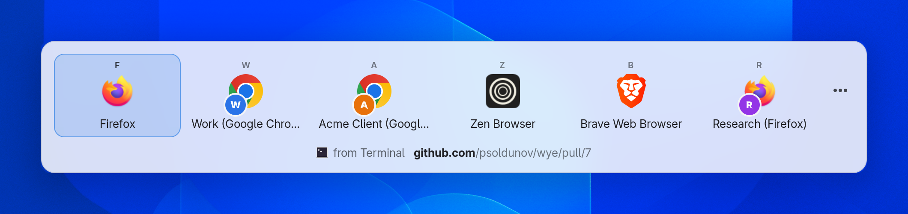

# Wye and Junction

  

[Junction](https://github.com/sonnyp/Junction) is the usual answer when someone on Linux
asks for a browser picker, so it is the app Wye is compared with most. Both register as the
default browser and both can show a chooser. They differ in when they ask, what they know
about your browsers, what they do to the link, and how they look on your desktop. Back to
the [README](../README.md).

## At a glance

| | Wye | Junction |
|---|---|---|
| What it is | A default browser that sends each link where your rules say, and asks only when none does. | An app chooser that asks about every file and link you open. |
| When it asks | When no rule decides. Make the picker your primary browser to be asked every time. | Every time. |
| Rules | By link, by the app the link came from and by the keys you held, with an optional JavaScript transform. | None. |
| Browser profiles | Found on its own for Chrome, Chromium, Brave, Vivaldi, Edge, Firefox, Zen, LibreWolf and Floorp, each tile with the profile's name and a badge in its colour. | A desktop file you write by hand for each profile. |
| The link | Tracking parameters removed, redirects such as Outlook Safe Links unwrapped and short links expanded, before any rule runs. | Opened as given. You can edit it first. |
| Keyboard | A hotkey on every tile, shown above it: one you choose per browser, a number or a letter of its name. Hold Shift for a private window, Ctrl for the background, Alt for a new window. | 1 to 9 by position, the arrow keys and Enter. |
| On KDE Plasma | Qt and Kirigami in Breeze. The picker is a blurred, translucent panel at the pointer. | A libadwaita window. |
| On GNOME | The picker and the tray menu are drawn inside GNOME Shell, blurred, at the pointer. Settings and the other windows are GTK 4 and libadwaita. | A libadwaita window. |
| Also | A tray menu with the clipboard link and recent links, a history with the reason each link went where it did, a browser extension for Firefox and Chromium. | Files, folders and any URI scheme. A bookmarklet for the browser. |
| Install | `.deb`, `.rpm` and AppImage for x86-64 and ARM64, a Nix flake with home-manager and NixOS modules. | Flathub. |
| Written in | Rust, with a Qt front end for KDE and a GTK and GNOME Shell front end for GNOME. | JavaScript (GJS), GTK 4 and libadwaita. |
| Licence | MIT | GPL-3.0 |

## It looks like your desktop

The picker is the part of a browser picker you see most, so Wye draws it with each
desktop's own toolkit instead of one toolkit everywhere.

- **KDE Plasma.** The picker, the tray menu and every window are Qt and Kirigami, in
  Breeze and your colour scheme. The picker is a borderless, translucent panel on KWin's
  overlay layer with blur behind it and no title bar. It appears at once, at the pointer,
  over the app you clicked in, and takes the keyboard straight away.
- **GNOME.** Wye's GNOME Shell extension draws the picker and the tray menu inside the
  Shell itself, so they look like the Shell's own popups, blur included. Settings and the
  other windows are GTK 4 and libadwaita.
- **Sway, Hyprland and niri.** With the GNOME frontend chosen, the GTK host draws the
  picker as a layer-shell overlay where the compositor has one.

Every tile has the browser's icon, its name and its hotkey. A profile shows its browser's
icon with a badge in the profile's colour, so the Work and the Personal profile of the
same browser are told apart at a glance. Under the tiles are the app the link came from and
the address, with the host in bold. Light and dark follow the desktop.

  <picture>
    <source media="(prefers-color-scheme: dark)" srcset="media/kde/screenshots/dark/picker.png">
    
  </picture>

  <picture>
    <source media="(prefers-color-scheme: dark)" srcset="media/gnome/screenshots/dark/picker.png">
    
  </picture>

<em>The picker on KDE Plasma (top) and on GNOME (bottom). Switch GitHub
to light or dark mode to see the other colour scheme.</em>

Junction is one GTK 4 and libadwaita window on every desktop. On GNOME that fits; on KDE
Plasma it is an Adwaita window among Breeze ones. It is an ordinary window, so the window
manager decides where it opens: its README has GNOME users turn on Mutter's
`center-new-windows` to keep it in the middle of the screen. Its tiles show icons only
until you turn on app names, so three Firefox profiles are three identical Firefox icons,
and its troubleshooting section suggests editing the desktop files to give them different
icons. Until version 1.13 (September 2026) it was always dark. It now follows the light or
dark scheme and the accent colour through the desktop portal.

The tours show every surface of Wye: [KDE Plasma](tour.md) and [GNOME](tour-gnome.md).

## When it asks

Junction asks about every link. It has no rules, so it cannot learn that Jira links go to
the work profile and YouTube goes to Brave, and you answer the same question on every
click.

Wye asks only when nothing else has decided. Its rules match the link, the app you clicked
it in and the keys you held, and the first rule that matches sends the link where it says.
A rule can also run a short JavaScript transform on the link. When the picker does ask,
**Create Rule…** in its menu (`Ctrl+R`) opens the rule editor already filled in with the
link's domain and the app it came from, so one answer can become the default.

If you do want to be asked every time, make the picker your primary browser. Wye then
works like Junction for every link your rules leave alone.

## Browser profiles

Junction offers the apps your desktop knows about. To choose a Firefox profile, its README
has you write a desktop file for each profile by hand and then refresh the desktop
database.

Wye finds the profiles of Chrome, Chromium, Brave, Vivaldi, Edge, Firefox, Zen, LibreWolf
and Floorp itself, Firefox's newer profile groups included. Every profile is a target: in a
rule, as the primary or alternative browser, or as a picker tile. A profile you create
later appears after **Rescan**. See [Browser profiles](../README.md#browser-profiles).

## The link itself

Junction opens the link it was given. It shows you the address and lets you edit it, but
unwrapping an Outlook Safe Link or deleting the `utm_` parameters is your job.

Wye does both before any rule runs, and expands short links on the domains you allow. The
global transform script can rewrite links as well, for example `www.reddit.com` to
`old.reddit.com`. The picker's menu has **Copy Link**, and `wye test <url>` prints every
step a link goes through.

## Choosing with the keyboard

Junction opens the app at position 1 to 9 when you press its number; the arrow keys and
Enter move and choose.

Every tile in Wye's picker shows its hotkey above it. By default you choose the key for
each browser in **Shown Browsers**, so Brave can stay `B` however the tiles are ordered;
the Picker page switches to numbers by position or to letters from the names instead. Hold
Shift as you choose and the link opens in a private window, Ctrl opens it in the background
and Alt in a new window, and the picker names the action while you hold the key.
Right-click a tile for the same choices in a menu.

## Where Junction fits better

Junction is not only for links. It can be the default for files, folders, `mailto:` and
other schemes, and asks which app should open each one. Wye takes `http` and `https` links,
and local HTML files when you turn that on. Junction is on Flathub and also runs on Linux
phones; Wye is for the desktop and ships as `.deb`, `.rpm`, AppImage and Nix.
