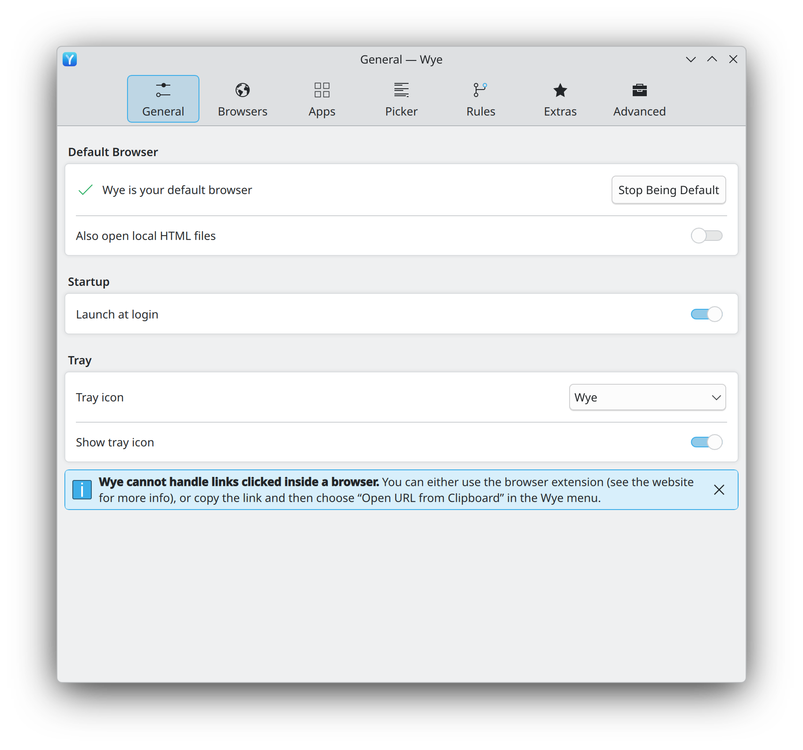

# 03 · Settings window

One window holds all of Wye's configuration, split into seven pages. This file covers the
window itself, the building blocks the pages share, and how each block maps to native
GNOME and KDE Plasma widgets. The pages are in [04](04-general.md) to [10](10-advanced.md).

  <picture>
    <source media="(prefers-color-scheme: dark)" srcset="../media/kde/screenshots/dark/settings-general.png">
    
  </picture>

<em>As implemented on KDE Plasma.</em>

## Window

| ID | Requirement | Evidence |
|---|---|---|
| SET-01 | A single settings window, titled with the name of the current page ("General", "Browsers", …). | Specified |
| SET-02 | A page switcher across the top with seven pages, in this order: **General** (gear icon), **Browsers** (globe), **Apps** (app tile with a check badge), **Picker** (bulleted-list glyph, same as the picker target), **Rules** (Y-shaped fork of two arrows), **Extras** (sparkles), **Advanced** (two gears). Each item shows its icon above its label. | Specified |
| SET-03 | The selected page's item has a rounded highlight behind it, and its icon and label use the accent colour. | Specified |
| SET-04 | The window opens from the tray menu's "Settings…" item, with `Ctrl+,`, and when Wye is started again while already running with the tray icon hidden ([TRAY-05](01-tray-menu.md)). Only one settings window exists; opening it again raises it. | Specified (menu item, shortcut), Expected (single instance) |
| SET-05 | The window opens at a fixed default size of 34 × 38 grid units (the height capped at 85 % of the screen's available height), at least 26 × 20 grid units, and is resizable. Pages scroll inside the window; switching pages never resizes it. | Specified (proportions), Proposed (fixed size, scrolling pages) |
| SET-06 | Changes on pages apply and save immediately. Pages have no Save or Apply button. Sheets (shown browsers, rule editor) have their own Done / Save buttons. | Specified (no buttons on pages), Expected (instant apply) |
| SET-07 | `Escape` or `Ctrl+W` closes the window. Closing the window does not quit Wye. | Expected |
| SET-08 | The window reopens on the page that was last shown. | Proposed |

## Shared building blocks

| ID | Block | Details | Evidence |
|---|---|---|---|
| BLK-01 | Group card | Rounded card, a step lighter than the window background. Rows inside are separated by inset hairlines. Optional bold group title above the card ("Startup", "Tray", "URL Expansion"). Cards are separated by vertical space. | Specified |
| BLK-02 | Row | Title on the left. Optional subtitle under it in smaller, dimmed text; it wraps and may contain accent-coloured inline links and inline `code`. Trailing control on the right, centred on the title. | Specified |
| BLK-03 | Switch row | Row with an on/off switch as trailing control. | Specified |
| BLK-04 | Target popup row | Row whose trailing control is a combo box showing the current target's icon and name, then its chevron. Opens the target menu ([TGT](05-browsers.md#target-menu)). | Specified |
| BLK-05 | Button row | Row with a push button ("Choose…", "Configure…", "Edit Script…", "Record Shortcut"). A button can sit next to a switch in the same row ("Configure…", "Edit Script…"). | Specified |
| BLK-06 | Inline radio row | Row with a horizontal radio group as trailing control ("Small", "Medium", "Large"). | Specified |
| BLK-07 | Text entry row | Row with a title and an entry whose text is right-aligned ("Name"). | Specified |
| BLK-08 | Help button | Small round "?" button after a row title or before the trailing control. Opens a popover that explains the setting. Texts are in [19-help-texts.md](19-help-texts.md). | Specified (button), Proposed (texts) |
| BLK-09 | Callout | Info card drawn as the desktop's own inline message, with its close button at the end and an optional bold title ("Please Read"). Text may use bold for emphasis and inline `code`. Closing hides the callout for good. | Specified (callout), Expected (persisted dismissal) |
| BLK-10 | Disabled row | Dimmed title, help button and control when the setting does not apply ("Force new window"). | Specified |
| BLK-11 | Sheet | Modal panel over the settings window; the window behind is dimmed and inert. Own header with a title ("New Rule"), a scrolling body, and a pinned footer with an optional note and the buttons. The primary button uses the accent colour and stays disabled until the content is valid. | Specified |
| BLK-12 | Empty state | The desktop's placeholder message, centred: a large dimmed icon and title ("No Rules"), a short explanation, and an optional action button ("Add Rule…"). | Specified |
| BLK-13 | List toolbar | Bar attached to the bottom of a list card: labelled buttons at the left ("Add Rule…"), a "⋯" menu button at the right that opens and closes its menu. | Specified |
| BLK-14 | Section with add button | Bold section title with a small "+" button beside it, a dimmed subtitle, then a list card showing a placeholder ("No Matchers") when empty. | Specified |
| BLK-15 | Reorderable checklist | Rows with checkbox, icon, name, a small popup, and a drag handle (≡) on checked rows. | Specified |
| BLK-16 | Shortcut recorder | Button showing the shortcut, or "Record Shortcut" (not dimmed) until one is set; click, press keys, done. A global shortcut row ([ADV-05](10-advanced.md)) has one control that follows the session: where the desktop's shortcut portal is available, the current binding ("None" when unset) and **Change…**; on X11, the recorder and a clear button; with no mechanism, the command to bind and **Copy**. Where an action takes several shortcuts, each shows as a removable chip followed by "+" ([KEY-02](15-keyboard.md#controls)). | Specified (recorder), Proposed (chips) |
| BLK-17 | Inline links | Links in subtitles open through Wye's own pipeline, like any other link. | Proposed |
| BLK-18 | Modifier chooser | Four linked toggle buttons, **Shift**, **Ctrl**, **Alt**, **Super**, as a row's trailing control. The pressed set is the binding ([KEY-01](15-keyboard.md#controls)). | Proposed |

## Native control mapping

Wye follows the host desktop's toolkit and HIG, the same split Token Station uses
(libadwaita on GNOME, Kirigami on Plasma). Pages keep the same structure, order and copy
on every desktop; only the widgets change.

| Block | GNOME (GTK 4 + libadwaita) | KDE Plasma (Qt Quick + Kirigami) |
|---|---|---|
| Page switcher (SET-02) | `AdwViewSwitcher` in the header bar, or `AdwPreferencesDialog` pages | `Kirigami.NavigationTabBar` (icon above label) or a KCM-style category sidebar |
| Group card (BLK-01) | `AdwPreferencesGroup` with title | `Kirigami.FormLayout` sections, or `FormCard` from kirigami-addons |
| Row with subtitle (BLK-02) | `AdwActionRow` (`subtitle`, `use-markup`) | Form row label plus explanation text (`Kirigami.FormData` / `FormCard.FormTextDelegate`) |
| Switch row (BLK-03) | `AdwSwitchRow` | `QQC2.Switch`, or `QQC2.CheckBox` where the KDE HIG prefers checkboxes in settings forms |
| Target popup row (BLK-04) | `AdwComboRow` with an icon + label item factory and section headers | `QQC2.ComboBox` with icon delegates, or a button that opens a `QQC2.Menu` |
| Button row (BLK-05) | `AdwActionRow` with a suffix `GtkButton` | Form row with `QQC2.Button` |
| Inline radio row (BLK-06) | `AdwToggleGroup` (libadwaita 1.7+) or grouped `GtkCheckButton`s | `QQC2.RadioButton` group in a row |
| Text entry row (BLK-07) | `AdwEntryRow` | `QQC2.TextField` / `FormCard.FormTextFieldDelegate` |
| Help button (BLK-08) | `GtkMenuButton` with a `GtkPopover` | `Kirigami.ContextualHelpButton` |
| Callout (BLK-09) | `AdwBanner` or a custom card in the group list | `Kirigami.InlineMessage` with `showCloseButton` |
| Sheet (BLK-11) | `AdwDialog` | `Kirigami.Dialog` / `Kirigami.OverlaySheet` |
| Empty state (BLK-12) | `AdwStatusPage` | `Kirigami.PlaceholderMessage` |
| List toolbar (BLK-13) | Header-bar or bottom `GtkActionBar` buttons | `Kirigami.Action`s in the page footer |
| Reorderable checklist (BLK-15) | `GtkListBox` with drag source/target and `list-drag-handle-symbolic` | `Kirigami.ListItemDragHandle` |
| Shortcut recorder (BLK-16) | Shortcut dialog in the GNOME Settings style, or the portal's own binding UI ([13](13-linux-platform.md)) | `KeySequenceItem` (KQuickControls) |
| Modifier chooser (BLK-18) | `GtkToggleButton`s in a box with the `linked` style class | checkable `QQC2.ToolButton`s in a row |

On other desktops, use the GTK 4 variant without desktop-specific theming overrides, so
the system GTK theme applies. Whether Wye ships one toolkit everywhere or one frontend
per desktop is an open decision ([14](14-open-questions.md)).
