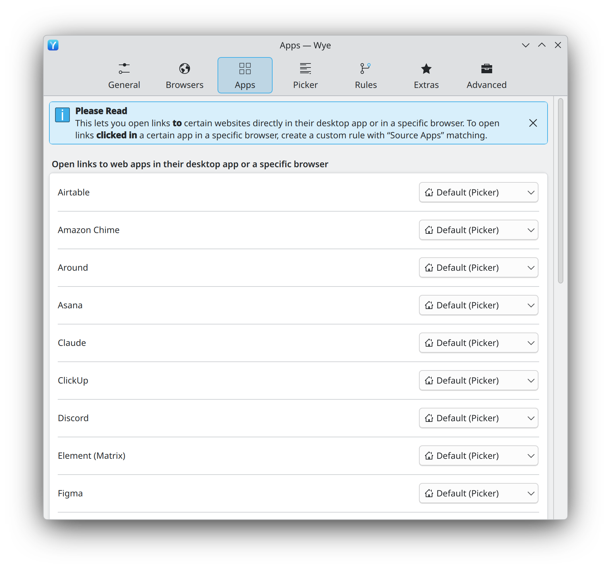

# 06 · Apps page (web app mappings)

The Apps page routes links **to** well-known web services: open a Discord invite in the
Discord desktop app, or always open Google Meet in the work browser profile. These
per-service mappings are the "built-in rules" of the pipeline
([PIPE-08](11-url-pipeline.md#processing-order)).

<p align="center">
  <picture>
    <source media="(prefers-color-scheme: dark)" srcset="../media/kde/screenshots/dark/settings-apps.png">
    
  </picture>
</p>

<p align="center"><em>As implemented on KDE Plasma.</em></p>

## Layout

```
┌───────────────────────────────────────────────────────┐
│ Please Read                                        ⊗  │
│ This lets you open links to certain websites …        │
└───────────────────────────────────────────────────────┘

Open links to web apps in their desktop app or a specific browser
┌───────────────────────────────────────────────────────┐
│ Airtable                    ☰ Default (Picker)    ⌃⌄  │
│ Discord                     ◉ Discord             ⌃⌄  │
│ Google Meet                 ◉ Work                ⌃⌄  │
│ …                                                     │
└───────────────────────────────────────────────────────┘
```

## Requirements

| ID | Requirement | Evidence |
|---|---|---|
| APP-01 | Dismissible callout ([BLK-09](03-settings-window.md#shared-building-blocks)) with bold title **Please Read** and the close button top-right: "This lets you open links **to** certain websites directly in their desktop app or in a specific browser. To open links **clicked in** a certain app in a specific browser, create a custom rule with “Source Apps” matching." | Specified |
| APP-02 | Bold heading: "Open links to web apps in their desktop app or a specific browser". | Specified |
| APP-03 | One card with a target popup row per known service, sorted alphabetically by service name. The page scrolls. | Specified |
| APP-04 | Every row starts at "Default (\<primary\>)", which follows the primary browser and whose label updates when the primary browser changes. A mapping left at Default does not match, so the link continues down the pipeline. | Specified (label), Expected (semantics) |
| APP-05 | When the service's desktop app is installed, the row's target menu shows it as its own section right below "Default" ([TGT-02](05-browsers.md#target-menu) section c). | Specified |
| APP-06 | A service can be routed to any target, including a browser profile or a private window (the design routes Google Meet to a browser profile). | Specified |
| APP-07 | Each service is described by a catalogue entry: display name; URL patterns (hosts and optional path prefixes); how to find its desktop app (desktop IDs, Flatpak app IDs, Snap names); and how to hand the link over (pass the `https` URL unchanged, or translate it to the app's own URL scheme). The catalogue is data shipped with Wye, so services can be added without code changes. | Proposed |
| APP-08 | Installed web apps (PWAs created by Chromium-based browsers, GNOME Web web apps) count as a service's desktop app when their start URL belongs to the service. | Proposed |
| APP-09 | Installing a service's desktop app does not change its mapping by itself; the user opts in. | Proposed |
| APP-10 | A mapping whose target app was uninstalled shows the target as missing (warning icon) and behaves like Default until fixed. | Proposed |

## Service catalogue

Services visible in the design, in order: Airtable, Amazon Chime, Around, Asana, Claude,
ClickUp, Discord, Figma, Front, Google Meet, Jitsi Meet, Linear; the list continues past
the visible part. Every service stays in the list even without a Linux desktop app,
because routing a service to a browser or profile is useful on its own.

Candidate Linux catalogue. Desktop-app availability and URL schemes must be verified
before shipping; entries marked "verify" are unconfirmed.

| Service | Linux desktop app | Hand-over |
|---|---|---|
| Discord | Discord (official; Flatpak `com.discordapp.Discord`) | `discord://` scheme (verify) |
| Slack | Slack (official; Flatpak `com.slack.Slack`) | `slack://` scheme (verify) |
| Spotify | Spotify (official; Flatpak `com.spotify.Client`) | `spotify:` URIs, e.g. `open.spotify.com/track/<id>` → `spotify:track:<id>` |
| Zoom | Zoom (official; Flatpak `us.zoom.Zoom`) | `zoommtg://` scheme (verify) |
| Telegram | Telegram Desktop (Flatpak `org.telegram.desktop`) | `t.me` links → `tg://` (verify) |
| Signal | Signal Desktop (Flatpak `org.signal.Signal`) | `signal.me` links (verify) |
| Steam | Steam (Flatpak `com.valvesoftware.Steam`) | `steam://openurl/<url>` |
| Element (Matrix) | Element (Flatpak `im.riot.Riot`) | `matrix.to` links (verify) |
| Jitsi Meet | Jitsi Meet Electron (verify) | verify |
| Zulip, Mattermost, Webex | official Linux clients (verify) | verify |
| Figma, Linear, Claude, Notion, Asana, Airtable, ClickUp, Front, Amazon Chime, Around, Microsoft Teams, Google Meet | no official Linux desktop app known (verify each); unofficial clients and PWAs via APP-08 | browser or profile routing |
