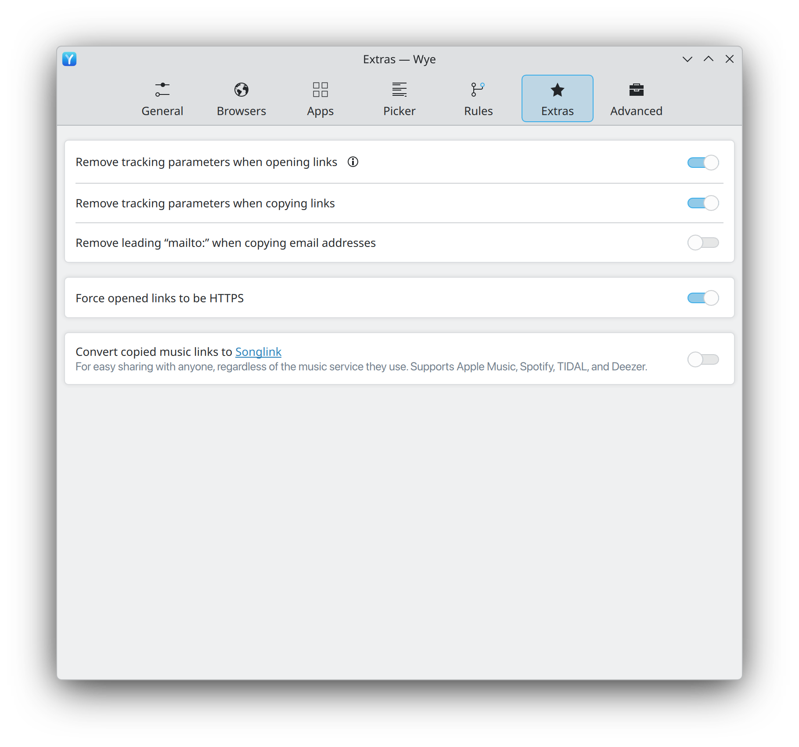

# 09 · Extras page (link cleaning and clipboard)

Link hygiene applied to opened links and, optionally, to links the user copies.

<p align="center">
  <picture>
    <source media="(prefers-color-scheme: dark)" srcset="../media/kde/screenshots/dark/settings-extras.png">
    
  </picture>
</p>

<p align="center"><em>As implemented on KDE Plasma.</em></p>

## Layout

```
┌───────────────────────────────────────────────────────────────┐
│ Remove tracking parameters when opening links     (?)  [on ]  │
│ Remove tracking parameters when copying links          [off]  │
│ Remove leading “mailto:” when copying email addresses  [off]  │
└───────────────────────────────────────────────────────────────┘
┌───────────────────────────────────────────────────────────────┐
│ Force opened links to be HTTPS                         [off]  │
└───────────────────────────────────────────────────────────────┘
┌───────────────────────────────────────────────────────────────┐
│ Convert copied music links to Songlink                 [off]  │
│   For easy sharing with anyone, regardless of the music       │
│   service they use. Supports Apple Music, Spotify, TIDAL,     │
│   and Deezer.                                                 │
└───────────────────────────────────────────────────────────────┘
```

## Settings

| ID | Requirement | Value in design | Evidence |
|---|---|---|---|
| EXT-01 | Switch row **Remove tracking parameters when opening links**, with a help button. | on | Specified |
| EXT-02 | Switch row **Remove tracking parameters when copying links**. | off | Specified |
| EXT-03 | Switch row **Remove leading “mailto:” when copying email addresses**. | off | Specified |
| EXT-04 | Separate card: switch row **Force opened links to be HTTPS**. | off | Specified |
| EXT-05 | Separate card: switch row **Convert copied music links to Songlink**, where "Songlink" is an accent-coloured link to song.link. Subtitle: "For easy sharing with anyone, regardless of the music service they use. Supports Apple Music, Spotify, TIDAL, and Deezer." | off | Specified |

## Behaviour

| ID | Requirement | Evidence |
|---|---|---|
| EXT-10 | Tracking removal deletes known tracking query parameters and keeps everything else, including the fragment. Global parameters include `utm_*`, `fbclid`, `gclid`, `dclid`, `msclkid`, `mc_cid`, `mc_eid`, `igshid`, `yclid`, `_hsenc`, `_hsmi`; site-specific rules cover cases such as `si` on YouTube and Spotify links. The help popover lists what is removed. | Expected (feature), Proposed (list) |
| EXT-11 | The parameter list comes from a maintained dataset (candidate: the ClearURLs rules, LGPL-3.0; check licence compatibility) plus Wye's own built-in list, so it can be updated without a code release. | Proposed |
| EXT-12 | Clipboard features (EXT-02, EXT-03, EXT-05) watch the clipboard. When its content changes to a single line of plain text, Wye applies the enabled rewrites and writes the result back once. Wye ignores its own writes (no loops), rich content, and entries that password managers mark as secret (`x-kde-passwordManagerHint: secret`). | Expected (feature), Proposed (guards) |
| EXT-13 | EXT-03 turns `mailto:name@example.com` into `name@example.com`. Query parts such as `?subject=` are removed with the prefix. | Expected (feature), Proposed (query handling) |
| EXT-14 | EXT-04 rewrites `http://` to `https://` before opening. Proposed exceptions: `localhost`, `*.localhost`, `*.local`, IP literals and private address ranges, and links with an explicit port. | Specified (feature), Proposed (exceptions) |
| EXT-15 | EXT-05 replaces a copied link from Apple Music, Spotify, TIDAL or Deezer with the matching song.link page. Candidate implementation: the Odesli API behind song.link (verify the endpoint and terms). On network failure, the clipboard stays unchanged. | Specified (feature), Proposed (implementation) |

## Linux notes

Clipboard watching and rewriting is easy on X11 (XFixes selection events) and on
Wayland compositors with a data-control protocol (KDE Plasma and wlroots compositors).
GNOME's compositor offers no data-control protocol to clients, so on GNOME these
features need Wye's Shell extension. Where no mechanism exists, the three clipboard
switches are disabled with a subtitle that explains why. See [13](13-linux-platform.md).
