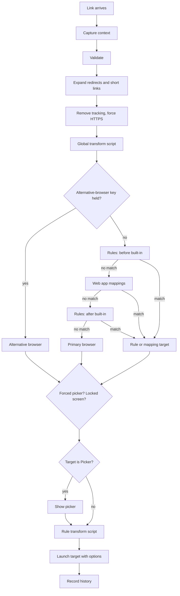

# 11 · Default-browser registration, entry points and processing order

Wye's core job: be the desktop's default web browser, receive every link, and forward it
to the right place. This file specifies how links reach Wye and the exact order in which
Wye processes them.

## Default-browser registration

| ID | Requirement | Evidence |
|---|---|---|
| DEF-01 | Wye installs a desktop entry with `Categories=Network;WebBrowser;` and `MimeType=x-scheme-handler/http;x-scheme-handler/https;`, so desktops list Wye as a web browser in their default-apps settings. The app ID uses the same reverse-DNS namespace as Token Station (for example `dev.soldunov.wye`; to be decided). | Proposed |
| DEF-02 | **Make Default** sets Wye as the handler for `x-scheme-handler/http` and `x-scheme-handler/https` in the user's `mimeapps.list` (the same effect as `xdg-settings set default-web-browser`), and applies the desktop's own browser setting where one exists (for example Plasma's browser setting in `kdeglobals`; verify). | Proposed |
| DEF-03 | Wye watches the `mimeapps.list` files. When another app becomes the default (browsers often offer this), Wye shows a notification: "Wye is no longer your default browser. \<App\> took over, so links skip Wye." with actions **Make Wye Default** and **Keep \<App\>**. The tray icon gets a warning overlay, and the General page shows the state ([GEN-05](04-general.md)). | Proposed |
| DEF-04 | Every link opened through the default browser starts Wye's handler. The handler is single-instance: the desktop entry sets `DBusActivatable=true`, so launchers deliver links to the running Wye with `org.freedesktop.Application.Open`, and the `Exec` fallback forwards the link over D-Bus and starts Wye when it is not running. Target: a link with no picker reaches its browser within about 100 ms of the click. | Proposed |
| DEF-05 | Wye remembers the default browser it replaced. It offers that browser as the first primary-browser suggestion during setup ([ONB-03](18-onboarding.md#first-run)) and restores it when the user clicks **Stop Being Default** (General page) or uninstalls Wye. | Proposed |
| DEF-06 | Loop guard: Wye never forwards a link to itself or to "the system default browser". Every target is a concrete app. | Proposed |
| DEF-07 | Local HTML files: Wye also registers for `text/html` and `application/xhtml+xml` only if the user turns that on (General page, Default Browser group, switch **Also open local HTML files**; default off). Such files follow the same pipeline as `file://` links. | Proposed |

## Entry points

| ID | Entry point | Pipeline differences | Evidence |
|---|---|---|---|
| IN-01 | Link opened in any app while Wye is the default browser (`xdg-open`, `gio open`, the OpenURI portal, direct desktop-entry launch). The main path. | Source app and held modifiers are captured when possible ([13](13-linux-platform.md)). | Specified (core behaviour) |
| IN-02 | Tray menu **Open URL from Clipboard**. | Full pipeline. Source app: none. | Specified |
| IN-03 | Global shortcut **Open URL from clipboard with primary browser**. | Full pipeline; if nothing matches, primary browser. | Specified (shortcut), Proposed (full pipeline) |
| IN-04 | Global shortcut **Open URL from clipboard with alternative browser**. | Opens in the alternative browser, as if the alternative-browser key were held (PIPE-06). | Specified (shortcut), Expected (behaviour) |
| IN-05 | Browser extension ([18-onboarding.md](18-onboarding.md#browser-extension)) through native messaging. | Picker forced when [ADV-10](10-advanced.md#miscellaneous) is on and the bypass key is not held. Source app: the sending browser. | Specified (setting), Proposed (extension) |
| IN-06 | **Preview Picker** ([PKS-06](07-picker-settings.md)). | Shows the picker with a sample link; opens nothing. | Specified |
| IN-07 | Command line: `wye open <url>` (full pipeline), `wye open --pick <url>` (force the picker), `wye open --alternative <url>`, `wye clipboard [--alternative]`. For scripts, tests, and compositor key bindings ([15](15-keyboard.md#global-shortcuts)). | As named. | Proposed |
| IN-08 | Rule tester ([DLG-TST](17-dialogs.md#rule-tester)). | Dry run: shows each step's result, opens nothing. | Proposed |

A phone sharing a link through KDE Connect or GSConnect arrives through IN-01 with that
app as the source app.

## Processing order

Stages marked ✱ are specified; the rest is this spec's ordering.

| Step | Stage | Details |
|---|---|---|
| PIPE-01 | Capture context | URL, entry point, source app (if known), held modifiers, screen-lock state, time. |
| PIPE-02 | Validate | Accept `http` and `https` (and `file` HTML when DEF-07 is on). Anything else: notification "Wye can't open this kind of link", link dropped. |
| PIPE-03 | Expand ✱ | Redirect wrappers and short links ([ADV-01](10-advanced.md#url-expansion)). Network expansion has a timeout; on timeout the pipeline continues with the unexpanded link. |
| PIPE-04 | Clean ✱ | Remove tracking parameters ([EXT-01](09-extras.md)), then force HTTPS ([EXT-04](09-extras.md)). |
| PIPE-05 | Global transform ✱ | [ADV-03](10-advanced.md#url-transformation), after expansion and cleaning. |
| PIPE-06 | Alternative-browser key | If the held modifiers equal the alternative-browser key ([BRW-03](05-browsers.md), exact match per [KEY-05](15-keyboard.md#controls)), or the entry point is IN-04: target = alternative browser; skip PIPE-07 to PIPE-10. The key is the user's escape hatch, so it beats rules. |
| PIPE-07 | Rules, "before built-in rules" ✱ | Top to bottom, first match wins ([RUL-03](08-rules.md)). Matching uses the normalised link (no scheme, no leading `www.`). |
| PIPE-08 | Built-in rules ✱ | Web app mappings ([APP](06-apps.md)). A mapping set to Default does not match. |
| PIPE-09 | Rules, "after built-in rules" ✱ | Same as PIPE-07. |
| PIPE-10 | Fallback ✱ | No match: primary browser. "Default" in a matched rule or mapping also means primary browser. |
| PIPE-11 | Forced picker ✱ | Entry point IN-05 with ADV-10 on and bypass key not held: target = Picker. `wye open --pick`: target = Picker. |
| PIPE-12 | Locked screen ✱ | Target is Picker, screen locked, [PKS-05](07-picker-settings.md) on: target = alternative browser (see [PKS-07](07-picker-settings.md) when that is also Picker). |
| PIPE-13 | Picker | Target is Picker: show it; the user's choice (and held picker modifiers, [KEY-13](15-keyboard.md#hotkey-scheme)) becomes the target. |
| PIPE-14 | Rule transform ✱ | If a rule matched and its **Transform URL** is on ([RUL-25](08-rules.md#rule-editor-sheet)), run its script. |
| PIPE-15 | Open ✱ | Launch the target with its options: background, new window, private, profile ([LAUNCH](05-browsers.md#discovery-and-launching)). |
| PIPE-16 | Record | Add to history when [ADV-09](10-advanced.md#history) is on. |

Performance target: everything except network expansion and the picker finishes within
10 ms.

## Clipboard pipeline

Separate from link opening. Runs when the clipboard changes and at least one of
[EXT-02, EXT-03, EXT-05](09-extras.md) is on: tracking removal, `mailto:` removal, music
link conversion, then a single write-back ([EXT-12](09-extras.md#behaviour)).
