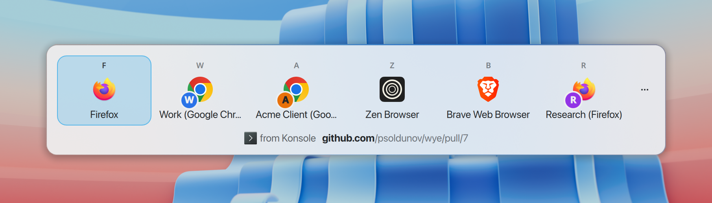

# Wye feature specification

Wye is a native Linux browser picker written in Rust. It lives in the system
tray and decides where each link opens: a specific browser, a browser profile, a private
window, a desktop app, or a small picker that asks the user.

## Core idea

Wye registers itself with the desktop as the **default web browser**. Every link the
user opens outside a browser (chat apps, mail, terminals, documents, `xdg-open`) comes to
Wye first. Wye cleans the link, runs the user's rules, and forwards it to the browser or
app the user wants, or shows the picker. Wye never renders web pages itself.

Everything else in this spec (tray menu, picker, settings pages, rules, link cleaning)
exists to make that interception fast, predictable and configurable. The interception
itself is specified in [11-url-pipeline.md](11-url-pipeline.md#default-browser-registration).

## Look and feel

Wye must look like it shipped with the desktop it runs on, the way
[Token Station](https://github.com/psoldunov/token-station) does: a Rust core, with each
surface drawn by the desktop's own toolkit and following its colour scheme, accent colour,
icon theme, fonts and spacing. This spec describes *what* each surface contains and does.
Widget-by-widget mapping to GNOME and KDE Plasma is in
[03-settings-window.md](03-settings-window.md#native-control-mapping). Platform mechanisms
are in [13-linux-platform.md](13-linux-platform.md).

  <picture>
    <source media="(prefers-color-scheme: dark)" srcset="../media/kde/screenshots/dark/picker.png">
    
  </picture>

<em>As implemented on KDE Plasma.</em>

## Scope

Wye covers link routing on Linux desktops: X11 and Wayland, with first-class support for
GNOME and KDE Plasma and a StatusNotifierItem fallback for other desktops. Features that
depend on mechanisms Linux does not have are out of scope; see
[14-open-questions.md](14-open-questions.md#out-of-scope).

## How to read this spec

Every requirement has an ID such as `PICK-04`. Use the ID in issues, commits and tests.

Every requirement carries one evidence tag:

- **Specified**: part of the design this spec was drawn from. Labels, order, layout and
  states are settled.
- **Expected**: behaviour the specified surfaces imply but do not show. Confirm the
  details while building.
- **Proposed**: designed by this spec where the source design is silent, including
  Linux-specific additions and every surface marked "new" below. It is the plan of record
  until someone decides otherwise.

User-facing copy is quoted as working copy, not final wording. Sizes are approximate
target proportions in logical pixels; the desktop's own metrics win.

## Surface inventory

| # | Surface | Kind | Source | Spec |
|---|---|---|---|---|
| 1 | Tray icon and menu | tray item + menu | design | [01](01-tray-menu.md) |
| 1.1 | Tray "More" submenu | submenu | new | [01](01-tray-menu.md#menu-layout) |
| 2 | Picker | floating chooser popup | design | [02](02-picker.md) |
| 2.1 | Picker "⋯" menu and tile context menu | menus | new | [02](02-picker.md) |
| 3 | Settings window (chrome, page switcher, shared controls) | window | design | [03](03-settings-window.md) |
| 3.1 | General page | settings page | design, extended | [04](04-general.md) |
| 3.2 | Browsers page | settings page | design, extended | [05](05-browsers.md) |
| 3.3 | Target menu (shared browser/app chooser) | popup menu | design | [05](05-browsers.md#target-menu) |
| 3.4 | Shown browsers sheet | modal sheet | design | [05](05-browsers.md#shown-browsers-sheet) |
| 3.5 | Apps page | settings page | design | [06](06-apps.md) |
| 3.6 | Picker page | settings page | design, extended | [07](07-picker-settings.md) |
| 3.7 | Rules page | settings page | design, extended | [08](08-rules.md) |
| 3.8 | Rule editor sheet | modal sheet | design, extended | [08](08-rules.md#rule-editor-sheet) |
| 3.9 | Extras page | settings page | design | [09](09-extras.md) |
| 3.10 | Advanced page | settings page | design, extended | [10](10-advanced.md) |
| 4 | Picker keys sheet | modal sheet | new | [15](15-keyboard.md#picker-keys-sheet) |
| 5 | Script editor | dialog | new | [16](16-script-editor.md) |
| 6 | App chooser | modal sheet | new | [17](17-dialogs.md#app-chooser) |
| 7 | URL expansion sheet | modal sheet | new | [17](17-dialogs.md#url-expansion-sheet) |
| 8 | History window | window | new | [17](17-dialogs.md#history-window) |
| 9 | Rule tester | modal sheet | new | [17](17-dialogs.md#rule-tester) |
| 10 | About window with troubleshooting | dialog | new | [17](17-dialogs.md#about-window) |
| 11 | First-run window | dialog | new | [18](18-onboarding.md#first-run) |
| 12 | Default-browser status and takeover warning | row, notification, tray overlay | new | [18](18-onboarding.md#default-browser-status) |
| 13 | Browser extension | companion extension | new | [18](18-onboarding.md#browser-extension) |
| 14 | Help popovers and rules help dialog | popover, dialog | new texts | [19](19-help-texts.md) |

"design" surfaces come from the design this spec was drawn from; "new" surfaces are
designed here. Every surface has a spec.

## Glossary

- **Target**: a place a link can open. One of: Picker, Default, a browser, a browser
  profile, a browser's private window, a desktop app, or any other app the user adds.
- **Picker**: the floating window that asks the user where to open a link. Also the
  special target that shows it.
- **Primary browser**: the target used when no rule or web app mapping matches.
- **Alternative browser**: the target used when the user holds the alternative-browser
  key while opening a link, or when the picker is skipped on a locked screen.
- **Alternative-browser key**: the modifier combination (default Shift) that sends a
  link to the alternative browser. Every key Wye uses is configurable
  ([15](15-keyboard.md)).
- **Shown browsers**: the ordered subset of targets that appears in the picker and in the
  tray menu, each with an optional picker hotkey.
- **Default**: a value in the Apps page and the rule editor that means "follow the
  primary browser". It renders as "Default (\<primary browser name\>)".
- **Web app mapping**: a per-service setting on the Apps page that sends links to that
  service to its desktop app or to a chosen target. Rules call these "built-in rules".
- **Rule**: a user-defined, ordered routing entry: URL matchers and source apps select a
  target plus options.
- **Source app**: the app in which the user clicked the link.
- **Pipeline**: the ordered processing each incoming link goes through before it opens
  ([11](11-url-pipeline.md)).

## Files

1. [01-tray-menu.md](01-tray-menu.md): tray icon and menu
2. [02-picker.md](02-picker.md): the picker popup
3. [03-settings-window.md](03-settings-window.md): window chrome, shared controls, native mapping
4. [04-general.md](04-general.md): General page
5. [05-browsers.md](05-browsers.md): Browsers page, target menu, shown browsers sheet, discovery
6. [06-apps.md](06-apps.md): Apps page (web app mappings)
7. [07-picker-settings.md](07-picker-settings.md): Picker page
8. [08-rules.md](08-rules.md): Rules page and rule editor
9. [09-extras.md](09-extras.md): Extras page (link cleaning, clipboard features)
10. [10-advanced.md](10-advanced.md): Advanced page (expansion, scripts, shortcuts, history)
11. [11-url-pipeline.md](11-url-pipeline.md): default-browser registration, entry points, processing order
12. [12-data-model.md](12-data-model.md): entities and settings implied by the UI
13. [13-linux-platform.md](13-linux-platform.md): Linux mechanisms per desktop, gaps and risks
14. [14-open-questions.md](14-open-questions.md): pending decisions, items to verify, out of scope
15. [15-keyboard.md](15-keyboard.md): every shortcut, hotkey and modifier key, all configurable
16. [16-script-editor.md](16-script-editor.md): script editor and transform-script API
17. [17-dialogs.md](17-dialogs.md): app chooser, URL expansion, history, rule tester, About
18. [18-onboarding.md](18-onboarding.md): first run, default-browser status, browser extension
19. [19-help-texts.md](19-help-texts.md): content for every help button
