# A tour of Wye

  

Every surface of Wye, as it looks on KDE Plasma 6 with Breeze. Switch GitHub to light or
dark mode to see the other colour scheme. The browser profiles, rules and links in the
images are demo data. Back to the [README](../README.md). On GNOME, see the [GNOME tour](tour-gnome.md).

## In action

A link clicked in Konsole opens the picker at the pointer. Picking the Research profile of
Firefox opens the page there.

  

## The picker

The picker opens at the pointer when no rule decides. Each tile is a browser or a browser
profile, with its hotkey above it and the link's source app and address below.

  <picture>
    <source media="(prefers-color-scheme: dark)" srcset="media/kde/screenshots/dark/picker.png">
    
  </picture>

Right-click a tile for the other ways to open the link. The "…" button opens the overflow
menu with the Open In submenu, Copy Link, Create Rule… and Settings….

  <picture>
    <source media="(prefers-color-scheme: dark)" srcset="media/kde/screenshots/dark/picker-tile-menu.png">
    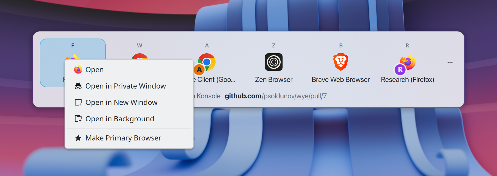
  </picture>
  <picture>
    <source media="(prefers-color-scheme: dark)" srcset="media/kde/screenshots/dark/picker-more.png">
    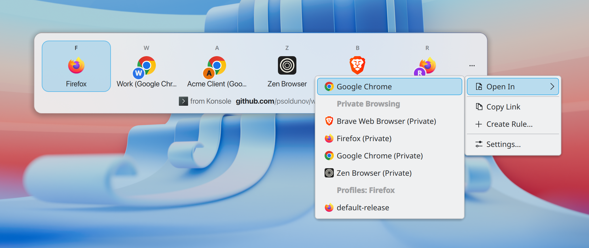
  </picture>

## The tray

The tray menu opens the clipboard link and chooses the primary browser. Its More submenu
holds History, Recent Links, Test Rules…, Rescan Browsers, Set Up Wye…, Help and About.

  <picture>
    <source media="(prefers-color-scheme: dark)" srcset="media/kde/screenshots/dark/tray-menu.png">
    
  </picture>
  <picture>
    <source media="(prefers-color-scheme: dark)" srcset="media/kde/screenshots/dark/tray-more.png">
    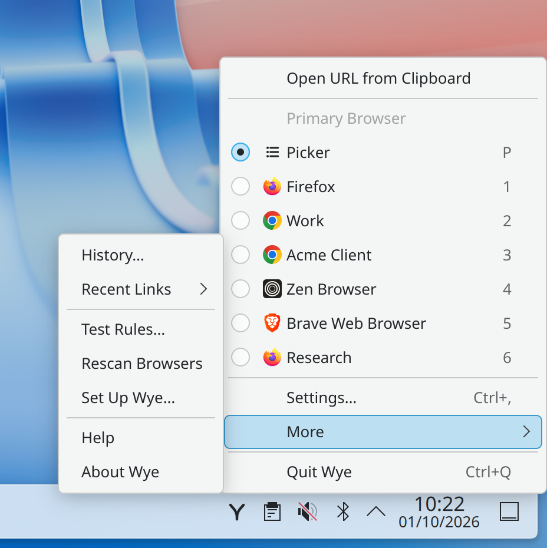
  </picture>

While history is on, Recent Links lists the last ten links you opened; choosing one opens it
in the picker again.

  <picture>
    <source media="(prefers-color-scheme: dark)" srcset="media/kde/screenshots/dark/tray-recent.png">
    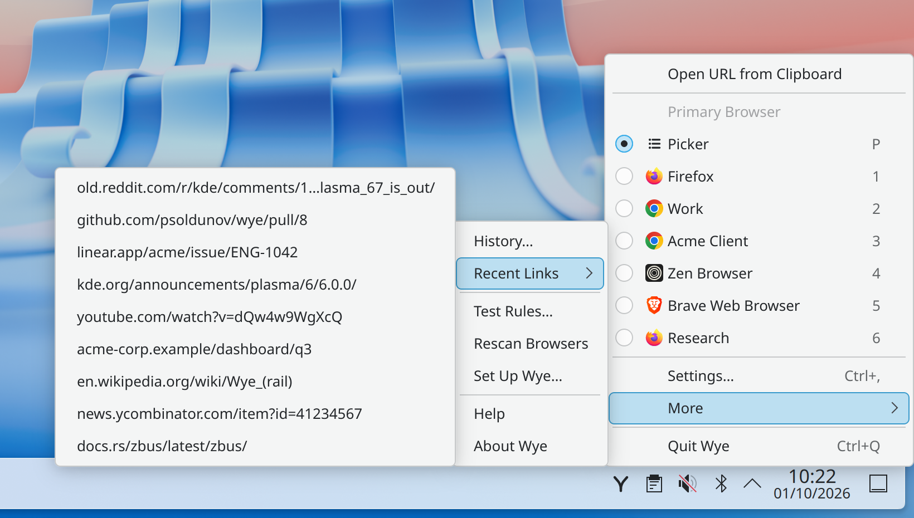
  </picture>

## Settings

Settings has seven pages: General, Browsers, Apps, Picker, Rules, Extras and Advanced.

  <picture>
    <source media="(prefers-color-scheme: dark)" srcset="media/kde/screenshots/dark/settings-general.png">
    
  </picture>
  <picture>
    <source media="(prefers-color-scheme: dark)" srcset="media/kde/screenshots/dark/settings-browsers.png">
    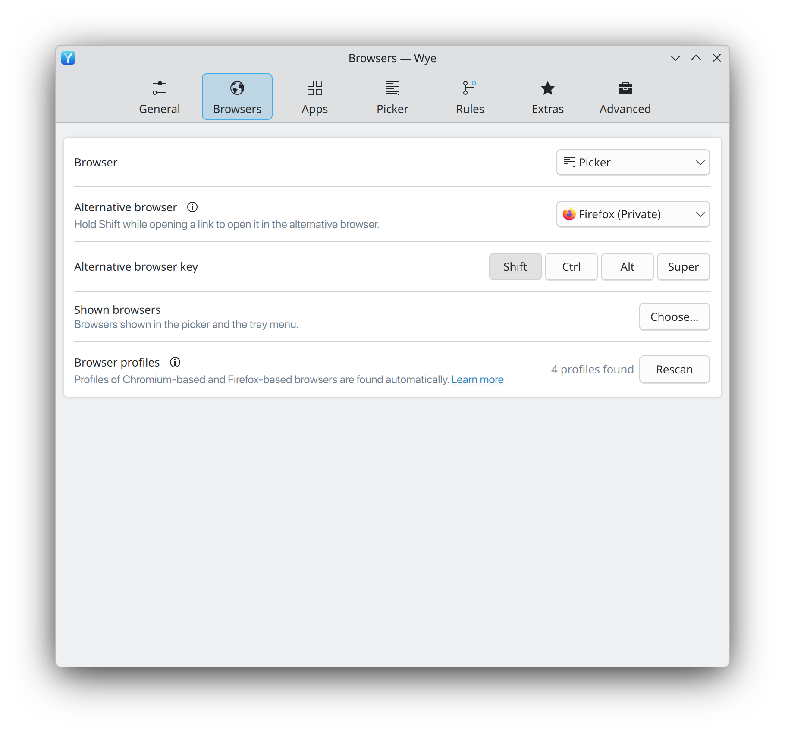
  </picture>

  <picture>
    <source media="(prefers-color-scheme: dark)" srcset="media/kde/screenshots/dark/settings-picker.png">
    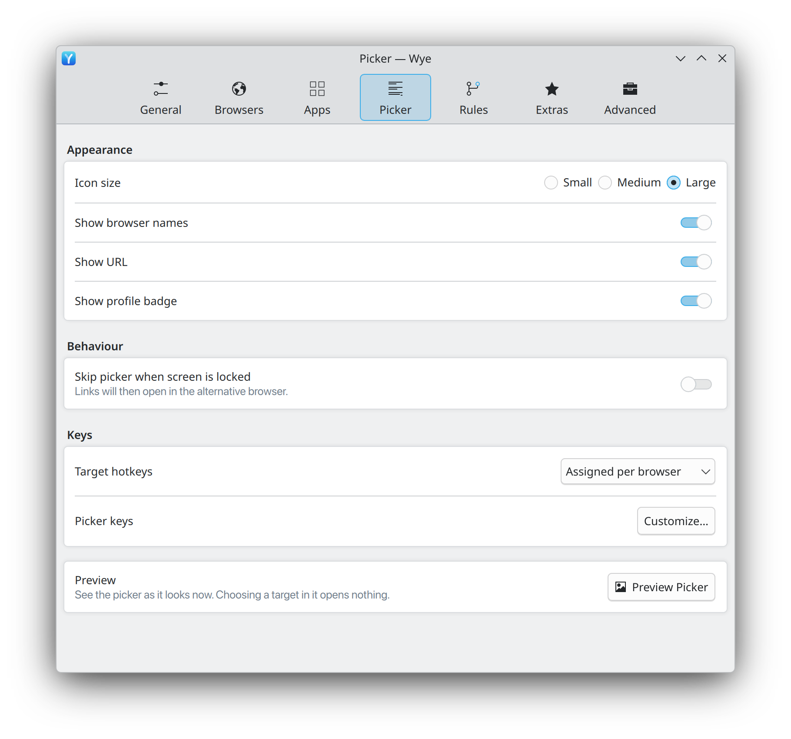
  </picture>
  <picture>
    <source media="(prefers-color-scheme: dark)" srcset="media/kde/screenshots/dark/settings-extras.png">
    
  </picture>

  <picture>
    <source media="(prefers-color-scheme: dark)" srcset="media/kde/screenshots/dark/settings-apps.png">
    
  </picture>
  <picture>
    <source media="(prefers-color-scheme: dark)" srcset="media/kde/screenshots/dark/settings-advanced.png">
    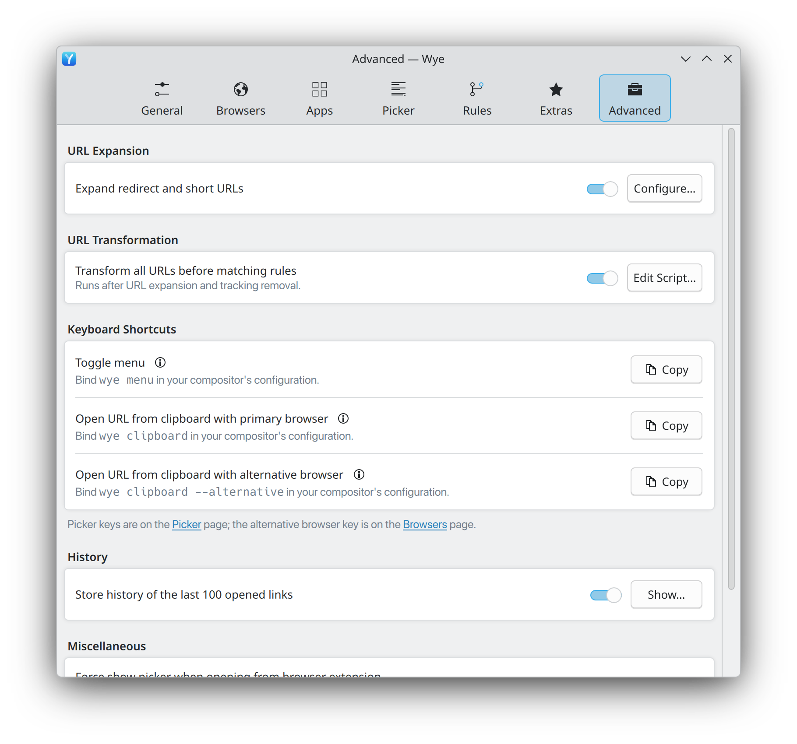
  </picture>

## Rules

Rules are listed top to bottom and the first match wins. A rule matches on the link, on the
source app, or on both.

  <picture>
    <source media="(prefers-color-scheme: dark)" srcset="media/kde/screenshots/dark/settings-rules.png">
    
  </picture>

The rule editor sets the target and the matchers. Test Rules… traces a link through link
cleaning, the transform script and the rules, and shows where it opens.

  <picture>
    <source media="(prefers-color-scheme: dark)" srcset="media/kde/screenshots/dark/rule-editor.png">
    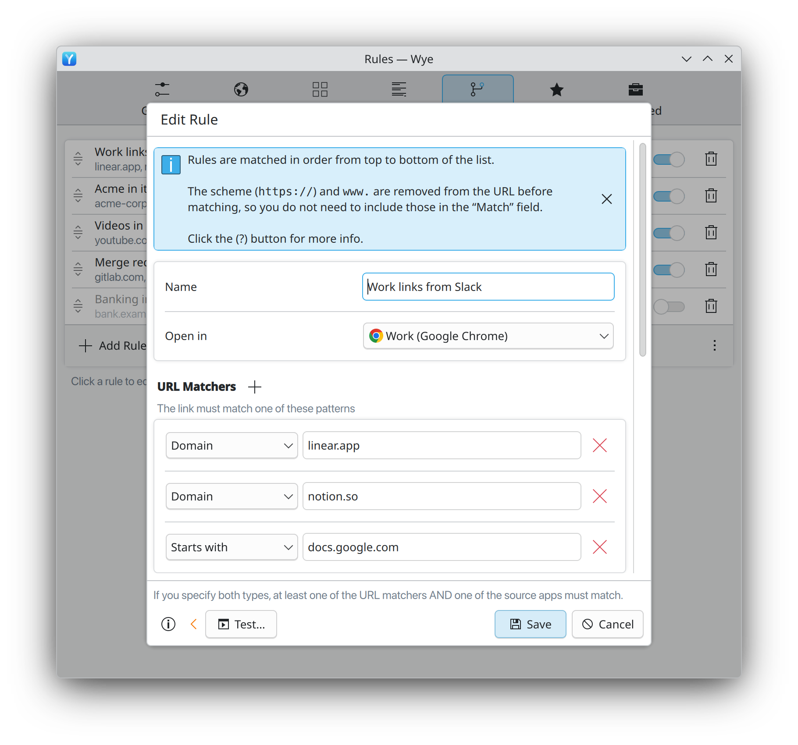
  </picture>
  <picture>
    <source media="(prefers-color-scheme: dark)" srcset="media/kde/screenshots/dark/rule-tester.png">
    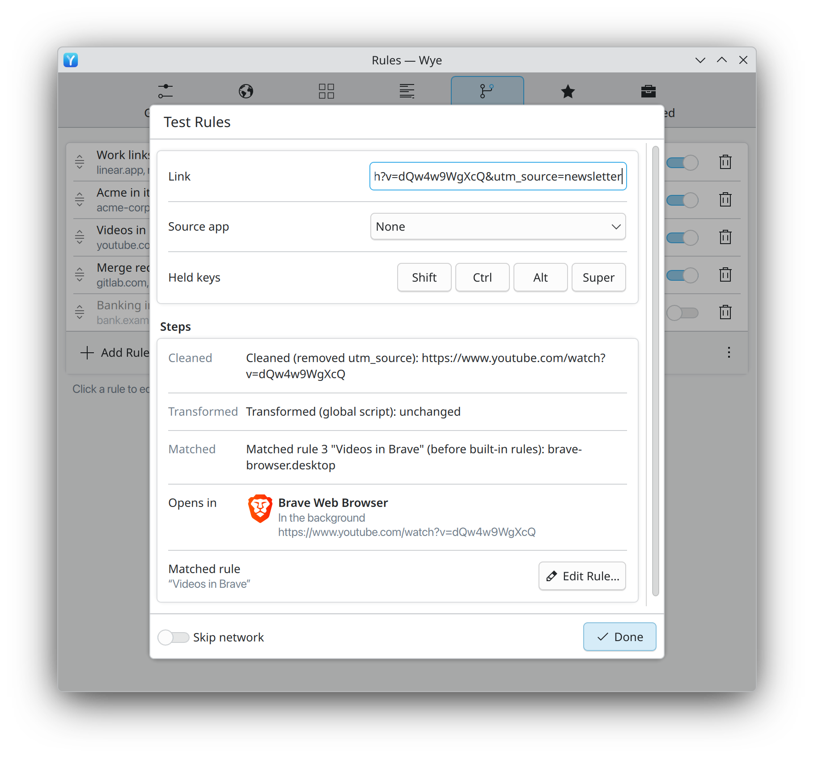
  </picture>

## Transform scripts

The global script and the optional script of each rule rewrite a link before it opens.
The editor shows the result for a test link as you type.

  <picture>
    <source media="(prefers-color-scheme: dark)" srcset="media/kde/screenshots/dark/script-editor.png">
    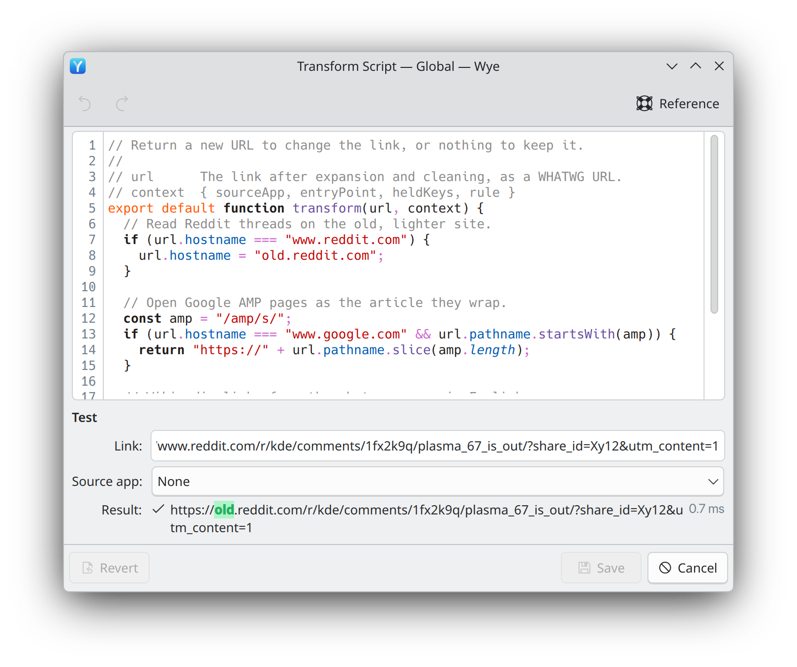
  </picture>

## History and About

The History window lists recent links with the reason each one went where it did. About
shows the version, the licence and where to report a bug.

  <picture>
    <source media="(prefers-color-scheme: dark)" srcset="media/kde/screenshots/dark/history.png">
    
  </picture>
  <picture>
    <source media="(prefers-color-scheme: dark)" srcset="media/kde/screenshots/dark/about.png">
    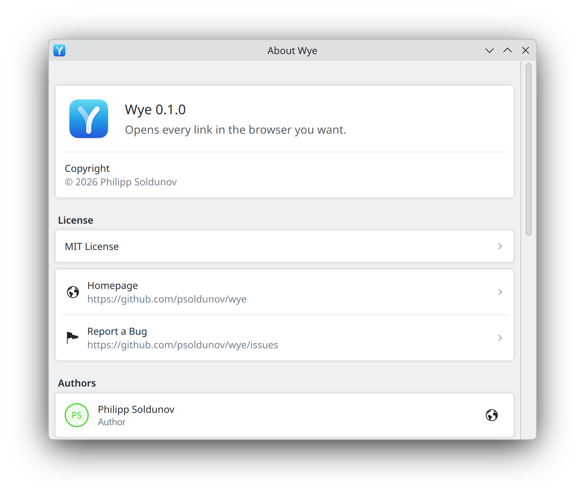
  </picture>

## First run

On first start Wye walks through making itself the default browser and choosing the
browsers to show.

  <picture>
    <source media="(prefers-color-scheme: dark)" srcset="media/kde/screenshots/dark/first-run.png">
    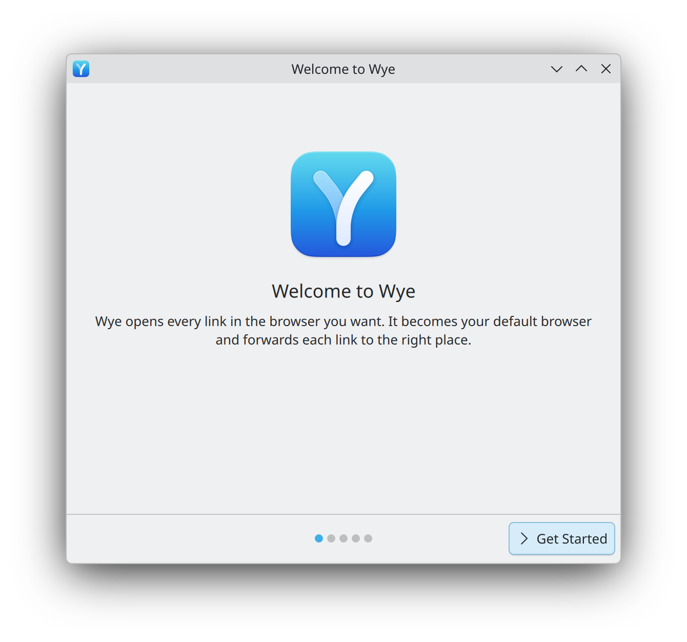
  </picture>
  <picture>
    <source media="(prefers-color-scheme: dark)" srcset="media/kde/screenshots/dark/first-run-browsers.png">
    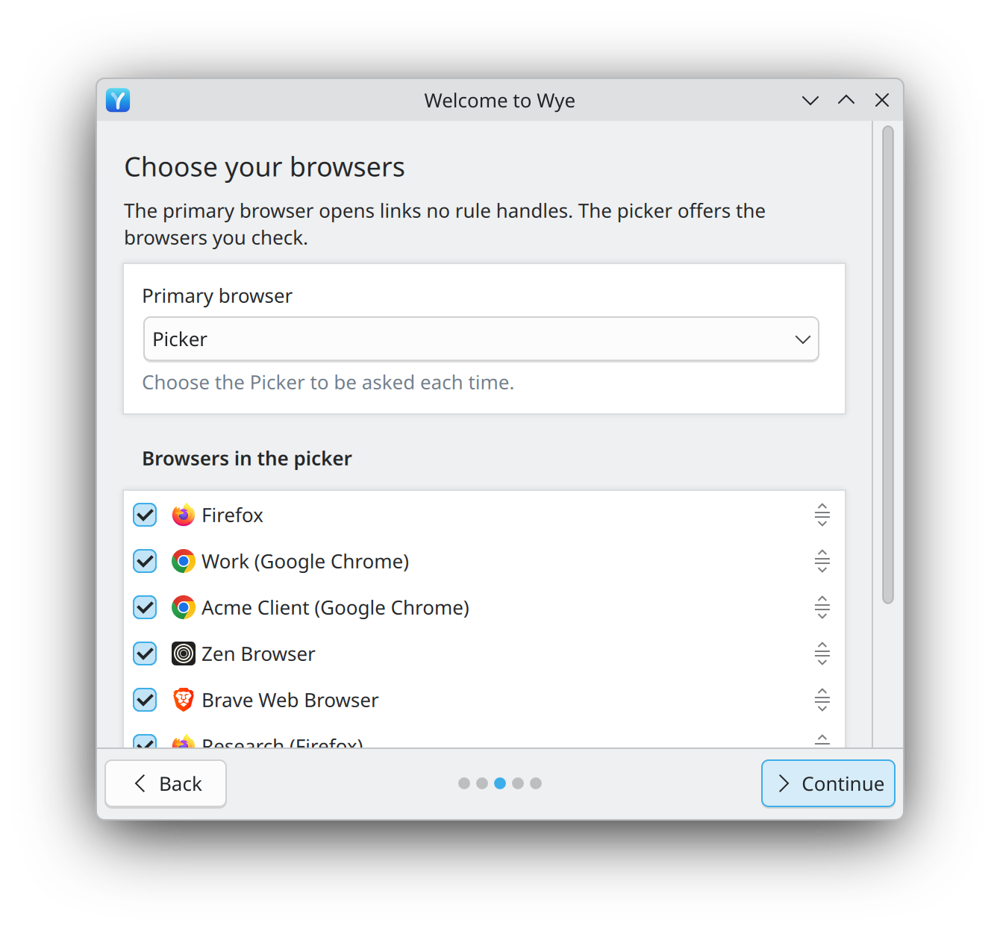
  </picture>

